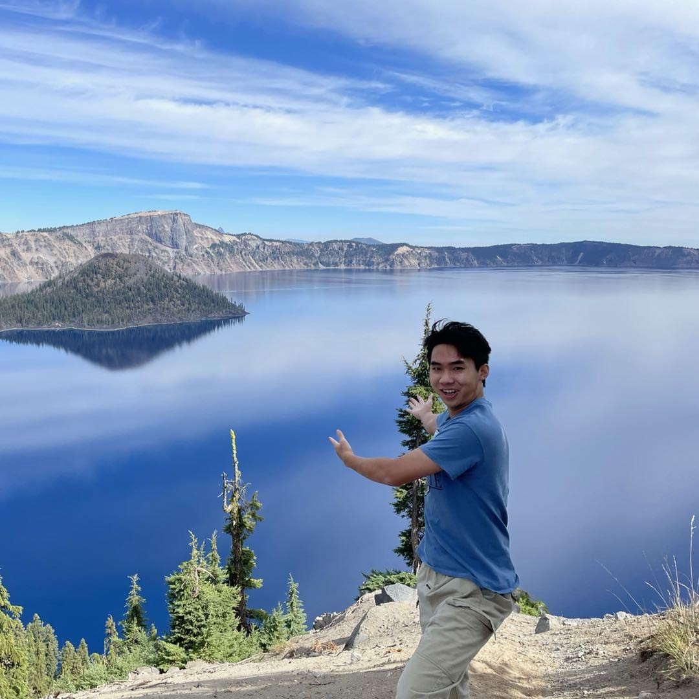
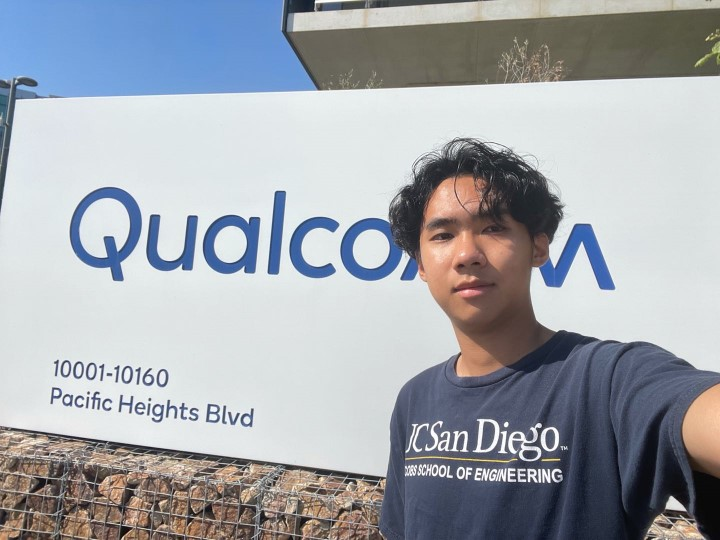
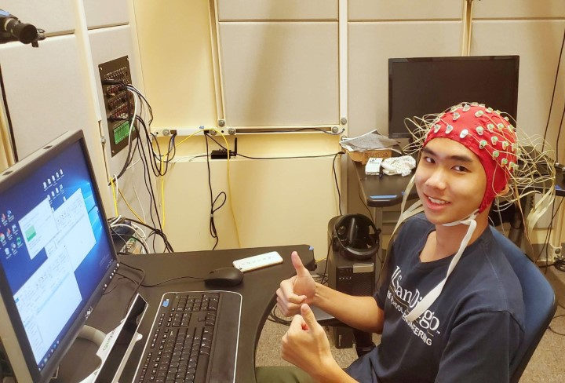
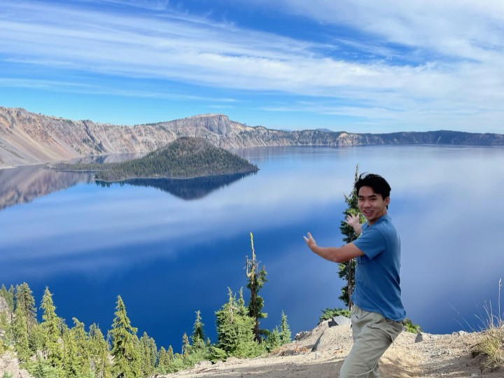
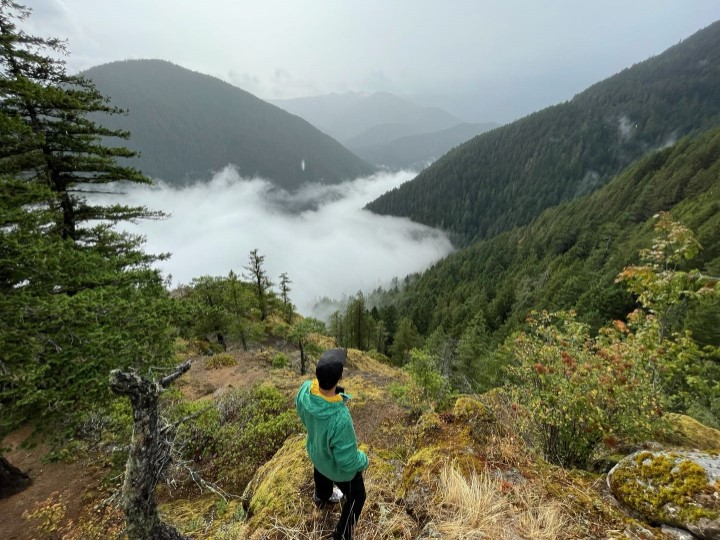
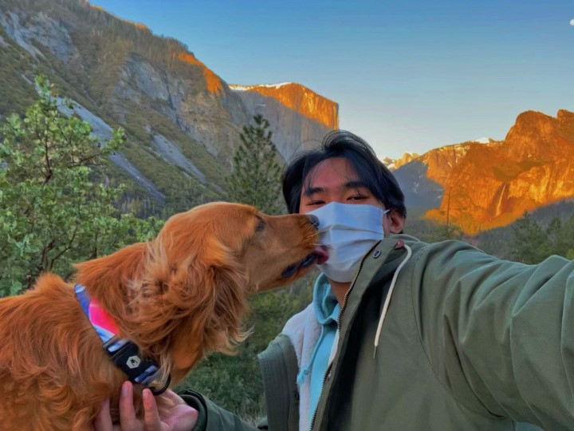

# Allan Sun's Landing Page

<!-- profile pic -->


Welcome to my landing page! I'm Allan, and I'm currently pursuing a B.S. in computer engineering at UCSD. I plan to focus my study on machine learning and computer architecture later in my career. My research interests includes machine learning, computer vision, and embedded system.

In the future, I want to use my skills and heart to develope technologies that will benefits the mankind, the weak, and the underprivileged. I believe my peer engineers and I together can achieve this. As Steve Jobs once said:
>“It's not a faith in technology. It's faith in people.”

If we go to the same school and you want to make friends 😆, check out my [Life and Hobbies](#hobbies-and-personal-interests)


<!--  To contact me, please email me at s8sun@ucsd.edu or via [LinkedIn](https://www.linkedin.com/in/allan-sun-55164b1a4/) -->

To contact me, please email me at `s8sun@ucsd.edu` or via
[](https://www.linkedin.com/in/allan-sun-55164b1a4/)
## Education
- **University of California, San Diego**
- Bachelor of Science in **Computer Engineering**
- Expected Graduation: **June 2023**


## Professional Experiences
### *Qualcomm Inc.*
\
Software Engineer Intern\
June - September 2023
1. Developed a test data visualization application to improve the efficiency of chip testing process that is now widely distributed and used in multiple Qualcomm branches in the U.S. and other countries
2. Created automated data retrieval procedures using REST APIs to generate dashboard reports using Python and SQL to identify
test case efficiencies

### *Translational Neuroengineering Lab (Gilja Lab, UCSD)*
\
Undergraduate Student Researcher\
March 2020 - Present
1. Led a group of 4 student researchers on a subproject on API integration, computer vision, and face recognition by managing 
project timeline and organizing group discussions
2. Worked on a computer vision project to create saliency maps to analyze the visual tasks performed by patients during 
experiments using TensorFlow (Python) and integrated a variety of open-source algorithms such as pair-code/saliency and
DeepGazeII
3. Completed an individual computer vision project to automatically estimate pupil measurements and gaze extraction to analyze
non-volitional emotional changes using OpenCV
4. Designed gamified experiments for clinical patients to gather data for machine learning and brain machine interface studies
5. Participated in code reviews during the development of the experiment framework and presented research results in formal occasions such as the UCSD Undergraduate Research Symposium


## Publications
- Affective response to volitional input perturbations in obstacle avoidance and target tracking games
  
    Aashish N. Patel, Geeling Chau, Cheng Chang, **Allan Sun**, Jingya Huang, Tzyy-Ping Jung, Vikash Gilja.\
    43rd Annual International Conference of the IEEE Engineering in Medicine and Biology Society, 2021 (Accepted)
## Achievements

- QHacks (Qualcomm Intern Hackathon) First Place Winner\
    Team Captain
    - Designed an active driver assistance system to prevent drowsy driving that alerts the driver when sleepiness is detected from the driver’s facial features using OpenCV and open-source computer vision libraries in Python
    - Led the team on every step of software development life cycle and presented the final product to the committee

## Skills

```
• Languages: Python, C++, C, Java, SQL, Bash, ARM Assembly
• Tools and Frameworks: Verilog, Git, Linux, TensorFlow, OpenCV, Power BI, Data Visualization
• Relevant Coursework: Advanced Data Structures, Computer Organization & Architecture, Object-Oriented Design, Digital Circuit Design, 
Microcontroller (Arduino) prototyping, Advance Algorithms, Intro to Machine Learning, Software Engineering
```

## Hobbies and Personal Interests
- When I'm not working or studying I like traveling (especially road trips 🚗), camping in the mountains 🏕️, and hiking in the wilderness ⛰️. For me, traveling is a great way to de-stress. I'm very proud of my recent trip to Oregon and Washington. The sceneries in the national parks were astonishing. Here are some pictures of me in multiple parks. If you are into nature like me, we will likely be friends.
- Follow me on instagram [](https://www.instagram.com/allancrapblah/)

 My national parks checklist (and those that are coming)
- [x] Olympic
- [x] Grand Teton
- [x] Yellowstone
- [x] Yosemite
- [x] Crater Lake
- [x] Everglades
- [x] Bryce Canyon
- [ ] Joshua Tree
- [ ] Redwood
- [ ] Sequoia
- [ ] ... 






